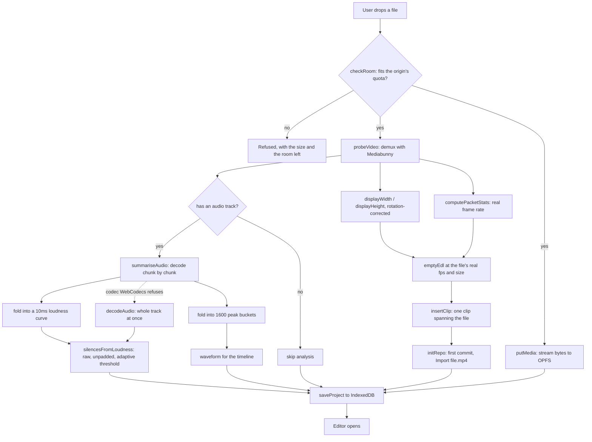
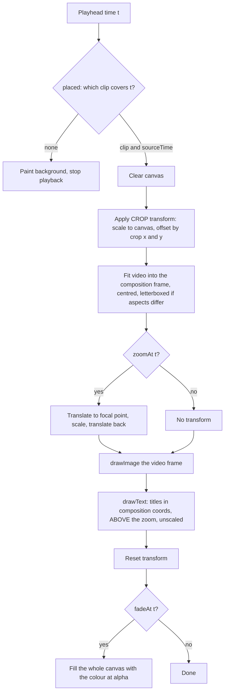
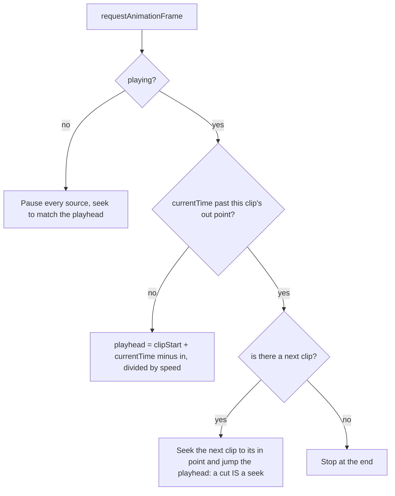
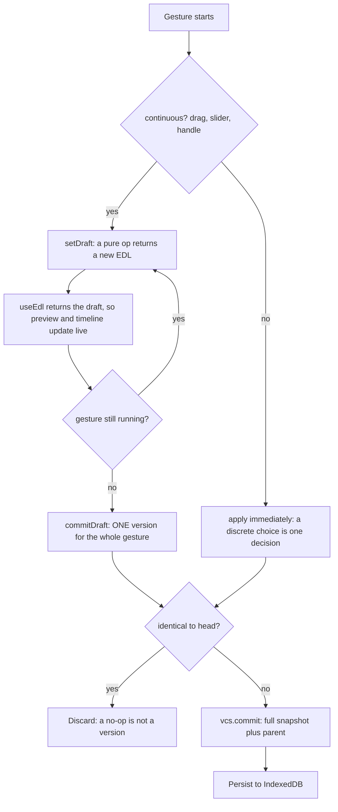
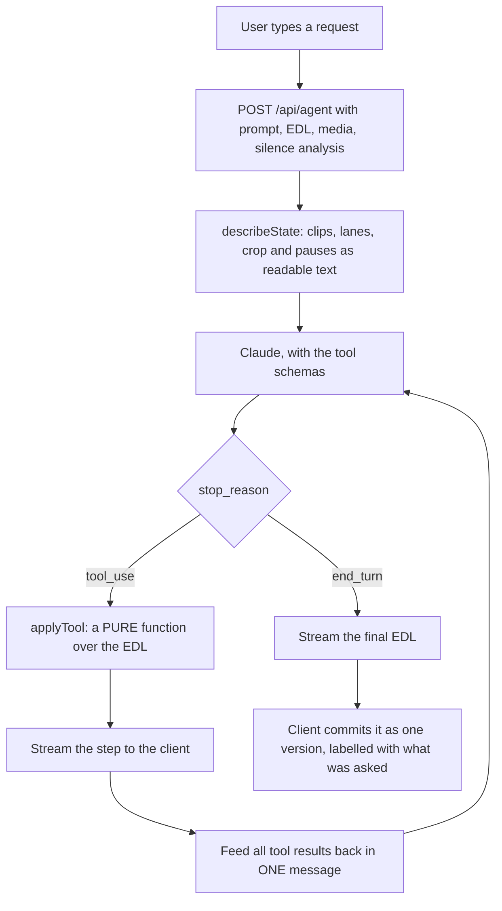
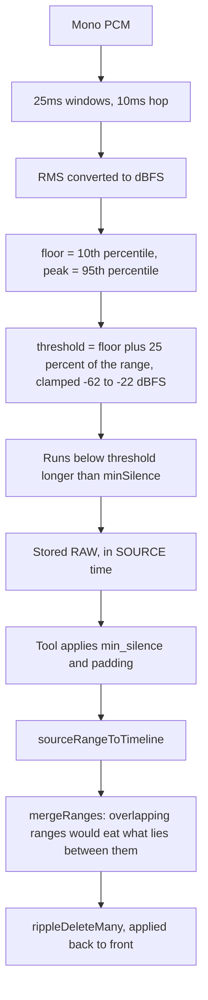

# Cutline — architecture and vocabulary

Video editing carries a lot of jargon, most of it inherited from film and none
of it obvious. Every term below is defined in general, then tied to where it
actually lives in this codebase.

- [The one idea](#the-one-idea)
- [The two coordinate systems](#the-two-coordinate-systems)
- [Vocabulary](#vocabulary)
  - [Editing](#editing)
  - [Time and frames](#time-and-frames)
  - [Picture](#picture)
  - [Effects](#effects)
  - [Audio](#audio)
  - [Files, codecs and containers](#files-codecs-and-containers)
  - [Storage in the browser](#storage-in-the-browser)
  - [Version control](#version-control)
  - [Interface](#interface)
- [Flows](#flows)
- [Where everything lives](#where-everything-lives)
- [Footguns](#footguns)

---

## The one idea

**The edit is a JSON document. It is never a video file until you export.**

Editing does not modify your footage. It builds a description of which pieces
of which files play, in what order, with what applied on top. Playback reads
that description and shows you the result. Export reads the same description
and encodes it.

```jsonc
{
  "version": 1, "fps": 30, "width": 1920, "height": 1080,
  "clips": [ { "id": "a1", "src": "m1", "in": 12.4, "out": 48.9 } ],
  "text":  [ { "id": "t1", "at": 1.0, "dur": 3.0, "content": "…" } ],
  "crop":  { "x": 0.34, "y": 0, "w": 0.32, "h": 1 },
  "tracks": [ { "id": "k1", "kind": "fade", "name": "Fade", "items": [] } ]
}
```

Everything else follows. The agent edits JSON. Version control snapshots JSON.
Preview *interprets* JSON. Nothing is rendered until export.

---

## The two coordinate systems

This is the most important concept in the codebase, and confusing the two is
the most common way to introduce a bug.

**Source time** — seconds into an original media file. "42 seconds into
`interview.mp4`." Editing never changes it, because the file never changes.

**Timeline time** — seconds into the *edit*. "42 seconds into the finished
video." Changes constantly, because removing five seconds moves everything
after it five seconds earlier.

```
SOURCE  interview.mp4   0 ──────────────────────────────────── 60s
                             ├── kept ──┤    ├── kept ──┤
                            12         28    40        52

TIMELINE (the edit)     0 ─────────────────── 28s
                          ├─ clip 1 ─┤├ clip 2 ┤
                          0          16        28
```

A clip's `in` and `out` are **source** time. Its position on the timeline is
**not stored** — it is the running total of the clips before it. The `at` on a
text overlay or an effect *is* timeline time.

`src/lib/edl/query.ts` owns every conversion: `placed()`, `resolve()`,
`sourceToTimeline()`, `sourceRangeToTimeline()`.

---

## Vocabulary

### Editing

**EDL — Edit Decision List.** The document above. Historically a literal
printed list an editor handed to a lab: which reel, which timecode in, which
timecode out. Ours is `Edl` in `src/lib/edl/types.ts`.

**Clip.** One continuous piece of one source file: a `src`, an `in` point and
an `out` point. A clip is a *window onto* a file, not a copy of it — ten clips
from one file cost nothing extra.

**In point / out point.** Where a clip starts and stops inside its source
file. `out` is exclusive.

**Cut.** The boundary where one clip ends and the next begins. As a verb, it
means removing material.

**Splice.** Physically joining two pieces of film. In software, two clips
adjacent on the track. Cutline's logo is a splice.

**Track / lane.** A horizontal row holding one kind of thing. The video track
holds clips; effect lanes hold fades or zooms. Called *tracks* in the model
(`Track`), *lanes* in the UI where they are drawn.

**Trim.** Change where a clip or effect starts or stops **without moving
anything else** — drag one edge, the opposite edge stays put. That is the whole
distinction between a trim and a move. `trimEffect()`, `trimClip()`.

**Split.** Cut one clip into two at a point, changing nothing about what plays.
Purely preparatory: you split so you can then delete or retime one half.
`splitAt()`.

**Ripple delete.** Remove a span **and close the gap**, so everything after
slides earlier and the video gets shorter. The alternative — a "lift" — leaves
a hole. Cutline only ripples. `rippleDelete()`.

> Why "ripple": the change propagates down the timeline. Every later clip
> shifts. This is why not storing positions matters — a ripple touches one
> array entry instead of rewriting a number on every clip after it.

**Contiguous track.** Cutline's video track has no gaps by construction: clips
play back to back in array order, and a clip's timeline position is the sum of
the durations before it (`placed()`).

**Speed / retime.** Playing a clip faster or slower. At 2× a 10-second clip
occupies 5 seconds of timeline. `clipDur()` divides source length by speed.

**Playhead.** The current position in the edit — the vertical line crossing
every lane, and what the timecode displays.

**Scrub.** Dragging the playhead through the video, watching frames fly past.
In Cutline this happens on the **ruler only**. The track below it is for
editing — dragging a clip's edge trims it — and one surface cannot mean both
"move the playhead" and "change this clip" without guessing.

**Ripple trim.** Dragging a clip's head inward on a contiguous track shortens
it *and* pulls everything after it earlier, because there are no gaps to leave
behind. `trimClipEdge()`.

**Seek.** Jump playback to a specific time.

### Time and frames

**Frame.** One still image. Video is a sequence of them.

**Frame rate / fps.** Frames per second — 24 (cinema), 25 (PAL), 30, 60. Read
from the file by demuxing, never assumed: `probeVideo()` derives it from
`computePacketStats().averagePacketRate`.

**Timecode.** A human-readable position. Cutline formats `M:SS.CS` — minutes,
seconds, centiseconds — in `fmt()`. Broadcast timecode is usually
`HH:MM:SS:FF`, where the last field is a frame number.

**Frame snapping.** Rounding a time to the nearest frame boundary. A cut can
only happen *between* frames, so a cut at 1.0173s on 30fps footage is
meaningless — it becomes frame 30, at 1.0s. `snap()`; every operation ends in
`normalize()`, which snaps everything.

> Snapping also keeps version diffs clean. Without it, two identical edits
> serialise to slightly different floats and every version looks changed.

**Tabular figures (`tnum`).** A font feature making every digit the same width,
so numbers do not jitter as they change. Essential for timecode; all timecode
goes through the `Timecode` primitive, which sets it.

### Picture

**Composition frame.** The coordinate space the edit is authored in —
`edl.width` × `edl.height`. Crop, zoom focal points and text positions are all
expressed relative to it.

**Resolution.** Pixel dimensions, e.g. 1920×1080.

**Aspect ratio.** Width divided by height. 16:9 landscape, 9:16 vertical, 1:1
square, 4:5 the portrait crop social platforms favour.

**Coded vs display dimensions.** A file stores pixels one way and a *rotation
flag* saying how to present them. Phone video is often coded 1920×1080 with
"rotate 90", displayed 1080×1920. Reading coded dimensions imports portrait
footage sideways — the exact bug that made us stop probing with a `<video>`
element and demux instead. Use `displayWidth` / `displayHeight`.

**Pixel aspect ratio.** Some formats have non-square pixels. Display dimensions
account for this too.

**Letterbox / pillarbox.** Black bars appearing when the picture's aspect does
not match the frame it is drawn into — horizontal bars (letterbox) or vertical
(pillarbox). The renderer fits the video into the composition frame and centres
it, producing bars if the aspects differ.

**Crop / reframe.** Keeping a rectangle of the frame and discarding the rest —
how a landscape recording becomes a vertical one. Stored as a normalised
rectangle (`{x, y, w, h}`, each 0–1) so it survives any resolution. "No crop" is
literally the unit rectangle, and a full-frame crop normalises back to
*absent*. `CropSchema`, `setCropAspect()`, `outputSize()`.

**Gate.** The aperture a film frame sits in while being shot or projected.
Here, the rounded rectangle the picture is drawn in.

**Mat.** The neutral mid-grey surrounding the picture. Not decoration: a black
surround makes footage read brighter than it is, so editors judge images
against mid-grey. `--color-mat`.

**Safe area.** The region of frame guaranteed visible on any display. Not
implemented here, but worth knowing the term.

### Effects

**Effect.** In Cutline, an interval on a lane: `{at, dur}` plus its own
parameters. Fades and zooms share this shape, so one drag model — move the
body, trim either edge — works for both.

**Fade.** A dissolve between the picture and a flat colour.

- *Fade in* — opens **from** the colour.
- *Fade out* — closes **to** it.
- *Dip* — passes through the colour and back, the standard transition between
  two scenes. Often called a "dip to black".

**Wash.** The coloured overlay a fade paints: a full-frame rectangle at an
alpha computed from how far through the fade you are (`fadeAt()`).

**Alpha / opacity.** 0 is fully transparent, 1 fully opaque.

**Swatch.** A small square or dot of colour you click to choose it. A curated
set beats a colour picker for a decision with a handful of sane answers — a
fade almost always resolves to black. Cutline's eight are Black, White, Warm
black, Print blue, Sepia, Leader, Grease and Bone, plus a custom well.
`FADE_COLORS`, `Swatches`.

> *Leader* is the amber film stock spliced onto the head of a reel. *Grease* is
> the china-marker red editors mark film with. The palette is named after the
> cutting room, and those two colours carry meaning throughout the UI.

**Zoom / punch-in.** Scaling the picture up so a portion fills the frame,
usually for emphasis. "Punch in" is the editorial term.

**Focal point.** The point a zoom scales **about**. Its defining property: it is
the one place in frame that **does not move** as the scale changes. That is why
Cutline lets you drag a target onto the picture instead of offering X and Y
sliders — the marker sits exactly where the push-in anchors, at any scale.

**Ramp / ease.** The seconds spent easing into and out of an effect rather than
snapping. `envelope()` returns 0–1 across an interval with eased ends.

**Smoothstep.** The easing curve used here: `t² (3 − 2t)`. It starts and ends
with zero slope, so motion begins and finishes gently. A linear ramp on a zoom
reads as a mechanical slide.

**Compositing order.** Which layer draws over which. Fixed here: zoom
transforms the picture → titles ride above it *unscaled* → the fade wash paints
last over everything. A caption that scales with a punch-in reads as a bug, and
a fade to black has to cover the captions too.

### Audio

**Sample.** One instantaneous amplitude measurement. **Sample rate** is how
many per second — 48000 for video, 44100 for CDs, 16000 for speech models.

**PCM.** Pulse-code modulation: raw uncompressed samples, what you get after
decoding.

**Channel / mono downmix.** Stereo has two channels; analysis needs one, so
they are averaged (`decodeAudio()`).

**Amplitude.** How far a sample deviates from silence, −1 to 1 in float audio.

**RMS.** Root mean square over a window — the standard measure of *perceived*
loudness across a span, as opposed to a single peak.

**Loudness curve.** RMS in dBFS at a fixed hop (10ms here), one number per
hop. It is what silence detection actually reads; the samples themselves are
never needed once it exists, which is what makes streaming analysis possible.

**Streaming analysis.** Decoding a track chunk by chunk and folding each chunk
into fixed-size results — here a loudness curve and a peak envelope — instead
of holding the decoded audio. An hour of 48kHz stereo is 1.4GB decoded and
about 4MB as a curve. `summariseAudio()`.

**Track offset.** The point in the container where an audio track's first
sample sits. It is rarely zero — a screen or camera capture typically starts
its audio a fraction of a second in — and it matters because every cut is
expressed in container seconds. Hops before that offset hold no samples, read
−180 dBFS, and turn the head of the file into a phantom pause.

**dBFS.** Decibels relative to full scale: a logarithmic scale where 0 dBFS is
the loudest representable signal and everything real is negative. Speech
typically peaks around −15 dBFS. Logarithmic because hearing is.

**Window and hop.** Loudness is measured over a sliding window (25 ms here)
advanced by a hop (10 ms). `loudnessCurve()`.

**Noise floor.** The quiet background always present — room tone, preamp hiss.
Never actually zero, which is why silence detection cannot test for zero.

**Adaptive threshold.** Cutline derives the silence cutoff from each file's own
dynamic range — the 10th percentile (floor), plus a quarter of the way to the
95th (peak), clamped to −62…−22 dBFS — rather than a fixed number. A quiet
phone recording and a loud studio mic then both work untuned.

**Silence detection.** Finding runs below the threshold longer than a minimum
(`minSilence`). The basis of "cut all the silences".

**Padding.** Leaving a margin of silence on each side of a cut so consonants
and breaths are not clipped. A cut landing exactly on the waveform sounds
truncated.

> Cutline stores detections **raw and unpadded**, so the agent can retune
> `min_silence` and `padding` per request without re-analysing the audio.

**Waveform / envelope.** The familiar audio picture: one peak amplitude per
bucket, drawn as bars. Cutline stores 1600 buckets per file and draws them
**normalised to that file's own peak** — scaling by absolute amplitude draws a
normally recorded voice as a flat 20% smudge.

### Files, codecs and containers

**Container.** The wrapper file format holding streams plus metadata: MP4, MOV,
WebM, MKV.

**Codec.** How picture or sound is compressed *inside* the container —
H.264/AVC, H.265/HEVC, VP8, VP9, AV1 for video; AAC, Opus for audio. "MP4" says
nothing about the codec by itself.

**Track / stream.** One channel of content inside a container: a video track,
an audio track, subtitles.

**Demuxing.** Splitting a container into its streams without decoding them.
Cheap. How Cutline reads real dimensions and frame rate.

**Muxing.** The reverse — packing encoded streams into a container. What export
will do.

**Decoding / encoding.** Turning compressed data into raw frames, and back.
Expensive.

**Packet.** One compressed unit in a stream. Sampling packet timing yields a
frame rate without decoding anything (`computePacketStats`).

**Keyframe / I-frame.** A frame encoded standalone. Others are stored as
differences from their neighbours, which is why seeking lands on keyframes and
why arbitrary-point seeking can be slow.

**VFR — variable frame rate.** Screen recordings often vary. An *average* rate
is the honest summary.

**WebCodecs.** The browser API giving JavaScript direct access to encoders and
decoders (`VideoEncoder`, `VideoDecoder`, `AudioDecoder`). What makes
client-side export possible at all. Support is broad now but not universal —
Safari below 26 cannot encode audio, Firefox Android has none — so export must
be capability-gated.

**Mediabunny.** The library used for demuxing, and planned for muxing on
export. It replaced `mp4-muxer`, which its own author deprecated in its favour.

### Storage in the browser

**OPFS — Origin Private File System.** A real filesystem the browser grants a
site, private to that origin and invisible in the user's file manager. Media is
written here on import: nothing uploads, import is instant regardless of size,
and a multi-gigabyte source costs nothing to host. `src/lib/media/opfs.ts`.

**Quota and persistence.** Storage is capped per origin and the browser
decides the number — typically a share of free disk. `navigator.storage
.estimate()` reports it, which is how an import that cannot fit is refused in
a second rather than failing halfway through. `navigator.storage.persist()`
asks the browser not to evict the origin under pressure; it may say no, and
the footage is written either way.

**IndexedDB.** The browser's structured database. Holds project metadata — the
commit history, media info, waveforms. `src/lib/db.ts`.

**Blob / object URL.** A `blob:` URL pointing at in-memory or on-disk data, so a
`<video>` element can play a file that was never served over HTTP.

**Same-origin / canvas tainting.** Drawing a cross-origin image onto a canvas
*taints* it and blocks reading pixels back. OPFS blobs are same-origin, so
`getImageData()` works — which is how the tests verify that fades and zooms
actually reach the picture.

### Version control

**Commit.** One version of the edit: a full snapshot, a parent pointer, a
message and an author (`you` or `agent`). `src/lib/vcs/repo.ts`.

**Snapshot vs patch.** Cutline stores the **whole document** per version, not a
diff. The document is tens of kilobytes, so snapshots cost nothing and restore
is O(1) — no replay, no merge algorithm, no corrupt-history failure mode.

**DAG.** Directed acyclic graph — the shape a commit history makes once
branches fork. Cutline walks first-parent only.

**Head.** The commit a branch currently points at; what you are looking at.

**Branch / variant.** A named pointer to a commit, surfaced as "variants": fork
a version, keep two cuts, switch between them.

**Restore.** Revisiting a version from a while back. Cutline commits it
*forward* as a new version rather than rewinding the pointer, so nothing
becomes unreachable.

**Undo.** Taking back the thing you just did. Deliberately different from
restore: it steps back **and deletes the entry**, because a history containing
every change *and* its reversal is a log of mistakes rather than a list of
states worth returning to. It will not delete a commit another branch still
reaches. Redo is held in memory only — undo left it nowhere else to live — and
any fresh edit discards it.

**Semantic diff.** Describing a change in the domain's terms — "−3 clips,
−12.4s" — rather than as a JSON patch. `diff()`.

**Draft.** An uncommitted edit shown everywhere the document is, so a drag
previews live while writing exactly **one** version when it ends. Without it, a
single slider pull leaves a hundred near-identical versions. `store.draft`,
`useEdl()`, `commitDraft()`.

### Interface

**Transport.** The playback controls — go to start, step a frame, play/pause,
step forward, go to end. Named after the tape transport mechanism.

**Jog / shuttle.** Moving frame by frame (jog) versus at variable speed
(shuttle). Cutline's arrow keys jog; shift coarsens to a second.

**Ruler.** The time scale above the lanes. Tick spacing is chosen from the
**pixels available**, not the duration — otherwise slowing a clip doubles the
label count without widening the ruler and the labels collide.

**Gutter.** The fixed-width label column at the left of every lane, so all lanes
share one time origin. It is `sticky` inside the timeline's scroller rather
than a separate column beside it, so it stays put while time scrolls past.

**Reorder, versus move.** On a track with free positions, dragging a clip
*moves* it and can leave a gap. Here it *reorders*: the clip changes places
with its neighbours and the track stays gap-free, because no clip stores a
position to move it to. `dropSlot()` answers which slot; `moveClip()` performs
the change.

**Span, versus duration.** The **duration** is how long the edit is; the
**span** is how much time the ruler is drawn across. They are usually equal.
They part company after a trim: the span holds at the longest the edit has
been, so the shortened clip keeps its scale and there is empty timeline to
drag its handle back out into. `Fit` reframes the span to the duration.

**Magnification.** How many viewport widths the timeline is drawn across —
1× is the whole edit at once, 8× spreads it over eight screens for frame-level
trimming. Expressed this way rather than in pixels per second so the number
means the same thing on any window and any footage.

**Position bar.** The slim bar under the lanes showing which slice of the
timeline is on screen. It exists because overlay scrollbars — the macOS
default — take no layout space and disappear at rest, leaving a zoomed
timeline with no sign that it continues.

**Inspector.** The contextual panel of controls for whatever is selected.
Always present, showing a hint when nothing is — letting it appear and
disappear resizes the card and shoves every lane upward mid-gesture.

**Reticle.** The crosshair marking the zoom focal point. Unfilled, with ticks
converging on a small core, because a filled disc reads as an *area* rather
than a point.

**Segmented control.** A row of mutually exclusive options sharing one
container — speed, fade direction, aspect presets. `Segmented`.

---

## Flows

### Import

Everything here runs locally. The video never leaves the machine.



### Rendering one frame

The compositing order is fixed and load-bearing. Runs every animation frame in
`Preview.tsx`.



### The playback clock

Naively advancing a timer drifts out of sync with audio. Instead the video
element *is* the clock while inside a clip, and a cut is handled as a seek.



### An edit becomes a version



### The agent

The server runs the tool loop but holds no state; the client owns the document.



### Silence to cut

The path that makes "cut all the silences" a real request rather than a guess.



---

## Where everything lives

```
src/lib/edl/types.ts      the document schema — read this first
src/lib/edl/query.ts      derived values and EVERY coordinate conversion
src/lib/edl/ops.ts        pure operations; each returns a new document
src/lib/vcs/repo.ts       commits, branches, semantic diff
src/lib/media/opfs.ts     media bytes on disk
src/lib/media/analyze.ts  demux probe, loudness, silence, waveform, WAV
src/lib/agent/tools.ts    tool schemas and dispatcher, shared client/server
src/lib/store.ts          app state, draft coalescing, the agent request
src/lib/db.ts             project persistence
src/app/api/agent/        the streaming tool loop
src/components/           Preview, Timeline, Transport, inspectors, overlays
src/components/ui/        design primitives — compose these, don't restyle
```

Nothing under `lib/edl` imports React or performs I/O. That is what lets the
same operations run in the browser and inside the server's tool loop.

---

## Footguns

Each of these was a real bug here, not a hypothetical.

1. **Mixing source and timeline time.** Every function names which it takes.
   When in doubt, `query.ts` converts.
2. **Deleting overlapping ranges separately.** Two overlapping spans applied one
   after another eat the content *between* them. Merge first (`mergeRanges`) —
   silence detection produces exactly this input shape.
3. **Applying ranges front to back.** Removing an earlier span moves every later
   one. Apply back to front, or recompute between each.
4. **Forgetting to snap.** Float drift makes identical edits serialise
   differently, and every version then looks changed.
5. **Committing per input event.** A slider pull becomes a hundred versions.
   Draft, then commit once.
6. **Reading coded dimensions.** Portrait phone footage imports sideways. Use
   display dimensions from a demux.
7. **Scaling a waveform by absolute amplitude.** Speech peaks nowhere near full
   scale and draws as a flat smudge. Normalise per file.
8. **A layout that changes height mid-gesture.** The timeline jumps out from
   under the cursor that just used it.
9. **Assuming an effect renders because its UI exists.** Sample canvas pixels —
   and sample off-centre, because synthetic test clips often draw something
   white dead centre.
10. **Decoding a whole audio track to analyse it.** `decodeAudioData` needs the
    entire file as an `ArrayBuffer` and expands it to Float32 at the source
    rate: an hour of 48kHz stereo is 1.4GB before the mono downmix, and the
    import dies with nothing but an out-of-memory in the console. Stream it and
    keep only the curve.
11. **Assuming an audio track starts at zero.** It usually does not. Place the
    curve at the track's own offset, or every cut lands early by that much and
    the head of the file reads as a pause that is not there.
12. **`h-full` on a flex item.** A percentage height against an auto-height row
    collapses to the content's own height. The frozen label column looked
    correct for weeks and was 20px tall over an 80px lane — invisible until
    something scrolled underneath it.
13. **Trusting the platform to draw a scrollbar.** macOS overlay scrollbars
    occupy no layout and vanish at rest, so an element that scrolls can look
    like an element that simply stops.
14. **Re-registering a global key listener on every edit.** Removing a listener
    while the event is still being dispatched means it is never called. Two
    components both listening on `window`, the first one changing state, and
    the second one's shortcut is dead — silently, and only for the keys the
    first component also handles.
15. **Measuring an element once, on mount, when it can be swapped out.** An
    empty track replaces the timeline's scroller with a placeholder. The
    `ResizeObserver` attached in a `[]` effect kept watching the detached
    element, read its width as 0, and every undo or restore after deleting
    the last clip drew the footage 120px wide. Attach through a callback ref,
    so the observer follows whichever element is actually mounted.
