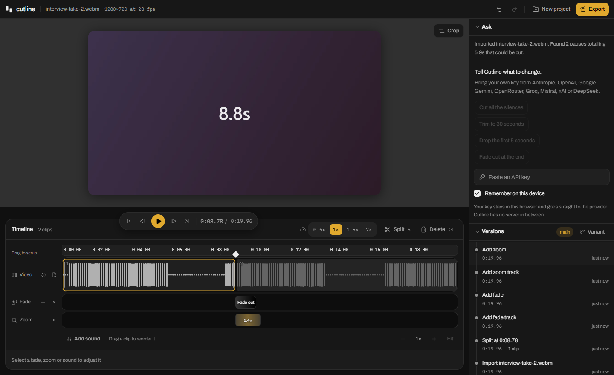

<div align="center">


# Cutline

**A video editor in your browser - version control, AI on your own key, and no sign-up.**

Cut by hand - it is built to be quick and obvious. Every change is a version you can go back to. And when you want it, an agent can do the tedious parts on a key you bring yourself. No account, no upload, no server.

</div>



## What makes it different

- **It is a real editor, by hand.** Split, trim, reorder, change speed, fades, punch-ins, music, reframing and export all work with no key, no agent and no account. Nothing here is gated behind AI.
- **Every change is a version.** Yours and the agent's alike. Restore any of them instantly, or branch into a variant to try a different cut without losing the first. Most editors ask you to be careful; this one lets you be wrong.
- **No sign-up, because there is nothing to sign up to.** No account, no cloud project, no server in between. Your footage is written to browser-private storage on your own disk and never leaves it — which is also why it is fast. The site counts anonymous page views, with no cookies and nothing personal; your footage, edits and keys are not part of it.
- **AI when you want it, on your own key.** Optional, and off until you paste a key. "Cut all the silences", "fade out at the end", "make it vertical", "undo that" — for the passes that are tedious to do by hand.

## What you can do

- **Cut.** Split, trim either edge, reorder, change speed, close the gaps. Trimming moves only the edge you drag; the rest of the track stays exactly where it was.
- **Add fades, punch-ins and music.** Each lives on its own lane, and drags catch on the cuts so your tracks line up.
- **Reframe** to 9:16, 1:1 or 4:5 for wherever the video is going.
- **Go back.** Undo, restore any earlier version, or open a variant.
- **Export the finished video**, encoded on your own machine.

## Try it

```bash
bun install
bun dev
```

No environment file, no keys, no services, nothing to configure. Drop in an MP4 or WebM and you are editing.

Import runs entirely on your machine: Cutline demuxes the file to read its real frame rate and display size, writes it to browser-private storage, and reads the audio to find the pauses. Frame rate and dimensions come from the container rather than from a `<video>` element, which reports _coded_ dimensions — otherwise rotated phone footage imports sideways.

## Version control, for video

The edit is a small JSON document, so a version is a full copy of it. That makes the whole feature cheap and exact rather than approximate.

- **Every edit commits a version** — a drag or a slider pull commits once when you let go, never a hundred times on the way.
- **Restore brings an old version back as a new one**, so going back is itself undoable.
- **Undo removes the version**, because a history of mistakes and their reversals is not a list of states worth returning to.
- **Variants are branches.** Try a tighter cut beside the first and switch between them; deleting one takes only the versions it alone reached, after telling you how many.
- **The history says what changed** — "−1 clip, −4.0s" — not just that something did.

## Ask, if you want to

The editor is complete without this part. Leave it alone and nothing is missing; turn it on when a pass would be tedious by hand.

Cutline ships no model access of its own. Paste a key from **Anthropic, OpenAI, Google Gemini, OpenRouter, Groq, Mistral, xAI or DeepSeek**, and the provider is read from the key itself.

- **Your key goes from your browser to your provider and nowhere else.** The agent loop runs in the page; there is no Cutline server in between.
- **It stays in this browser.** Remembered on this device by default, or only until the tab closes. It is never saved with a project.
- **Every manual action has a tool**, so loose requests work: the model is told where the playhead is, what you have selected, and what changed last, which is what makes "split here", "delete this" and "undo" mean something. It can do nothing you could not do yourself.

It also works from real analysis rather than guesses. Silence detection measures loudness in 25ms windows and sets its threshold from the file's own dynamic range, so a quiet phone recording and a loud studio mic both work untuned.

## Export

Cutline writes the finished video in your browser through WebCodecs, drawing every frame with the **same renderer the preview uses** — so what you watched is what you get, crop, punch-ins and fades included. The container comes from what your browser can actually encode: MP4 with H.264 where it is available because it plays everywhere, WebM otherwise, and the sound is kept in preference to the container. Audio is mixed a few seconds at a time, so a long edit costs no more memory than a short one.

## The idea

All of it rests on one decision: the edit is plain JSON, not video.

```jsonc
{
  "fps": 30,
  "width": 1920,
  "height": 1080,
  "clips": [{ "id": "a1", "src": "m1", "in": 12.4, "out": 48.9 }],
  "tracks": [
    {
      "kind": "fade",
      "items": [{ "at": 38, "dur": 1, "mode": "out", "color": "#000000" }],
    },
  ],
}
```

Because the edit is a document:

- **Version control is trivial.** The document is a few dozen KB, so every version is a full snapshot: instant restore, no replay, no merge algorithm, no corrupt history.
- **Nothing needs a server.** There is no project to store, no render farm and no account, because the edit is a file on your machine and the preview interprets it live.
- **The agent is an ordinary caller.** Its tools are the same pure functions your clicks call, which is why it can never do something the interface cannot.

The video track is **contiguous by construction** — clips play back to back in array order and no clip stores its timeline position, so a ripple edit touches one array entry instead of rewriting a position on every clip after it.

New to video editing? **[ARCHITECTURE.md](./ARCHITECTURE.md)** is a short guide to how a browser video editor actually works — the edit document, the two clocks, live preview, where decoding happens, versions and export — with every acronym spelled out.

## Layout

```
src/lib/edl/       types, pure operations, coordinate queries   ← the core
src/lib/vcs/       commit DAG, branches, semantic diff
src/lib/media/     OPFS store, audio analysis, silence detection
src/lib/render/    composeFrame: one frame of the edit, for preview and export
src/lib/export/    what to draw and mix, and the encoder that writes the file
src/lib/agent/     tool schemas + dispatcher: pure functions over the edit
src/lib/ai/        bring-your-own-key: providers, the agent loop, two wires
src/components/    preview + playback, timeline, chat, history
```

Two coordinate systems run through everything, and mixing them up is the main hazard: **source time** (seconds into an original file) and **timeline time** (seconds into the edit). `query.ts` owns the conversions.

## Tests

```bash
bun test                    # 240 unit tests: edit algebra, sound, snapping, silence DSP, agent tools, export planning, BYOK
bun test/e2e/verify.mjs     # 246 checks in real Chrome — records its own test video, and exports one back out
```

The end-to-end script records a 20-second clip with two deliberate silent stretches, imports it, and checks that analysis, editing, versioning, restore, playback, reload persistence and export all hold — then decodes the exported file back to prove it plays.

## Contributing

Bug reports and pull requests are welcome — **[CONTRIBUTING.md](./CONTRIBUTING.md)** covers how to get set up, what to run before opening a pull request, and the handful of rules that are load-bearing rather than stylistic.

## License

[MIT](./LICENSE). Use it, fork it, ship it.

## Not built yet

- **Transcription.** The audio-to-16kHz-WAV path is written and tested (`toWav16k`, about 1MB a minute), but nothing consumes it yet. Once something does, the agent can act on _words_ — "cut the part about pricing" — instead of only on silence.
- Multiple video tracks, b-roll compositing, transitions and colour.
